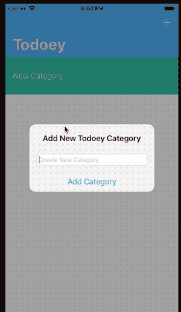
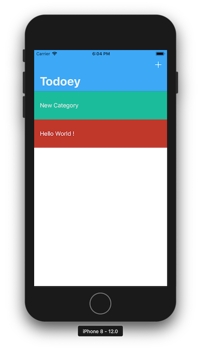
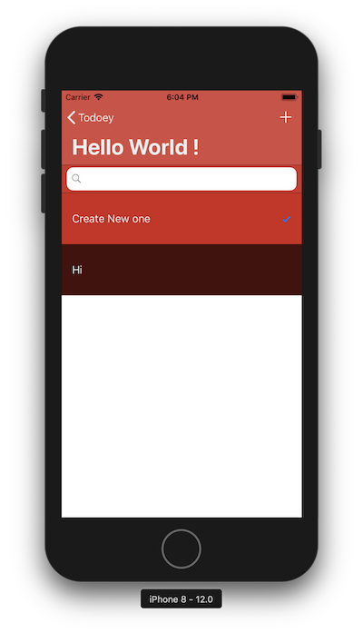
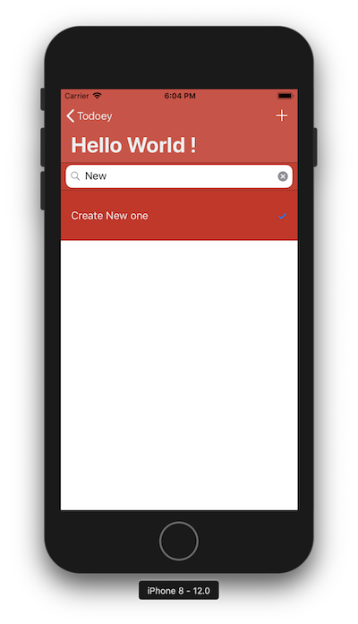

# Todoey

Personal work what I studied using Swift

#### iOS 11 & Swift 4 - The Complete iOS App Development Bootcamp

https://www.udemy.com/ios11-app-development-bootcamp/

---

### Todo List App

簡単なTodo Listアプリです。

使用したAPI

- ChameleonFramework
- RealmSwift
- SwipeCellKit

Check機能があります。

簡単な検索機能もあります。

`Realm`を使用し、ローカルでTodo Listを保存して管理するアプリです。